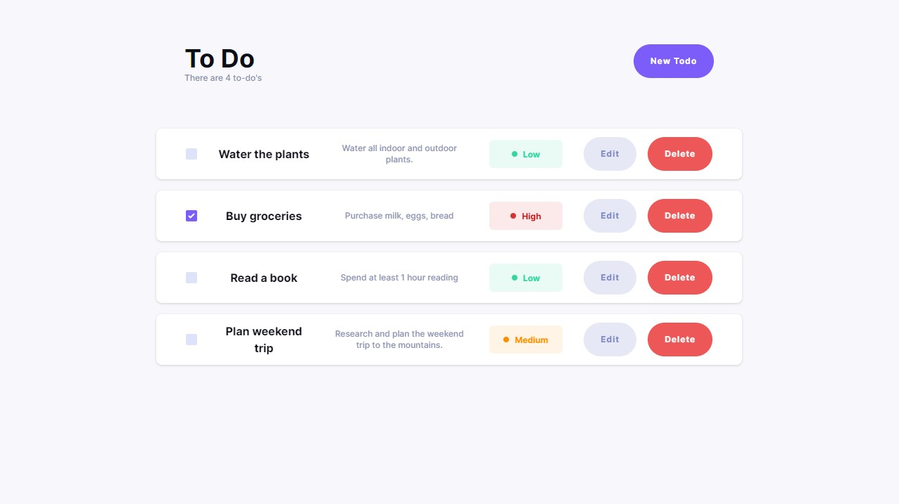

# To Do App

This is To-do list application, created as part of a hiring process.

## Table of contents

- [Overview](#overview)
  - [The challenge](#the-challenge)
  - [Screenshot](#screenshot)
- [My process](#my-process)
  - [Built with](#built-with)
- [Deployment](#deployment)
- [Author](#author)

## Overview

### The challenge

As part of the hiring process, the goal was to showcase proficiency in building a responsive To-Do list application with specific requirements:

- Users can add a new item to the existing list
- Users can edit an item from the existing list
- Users can mark the item as complete or mark the item as incomplete
- Users can delete the item from the existing list
- Users have access to their to-do items on any device. For data persistence use [Mockapi](https://mockapi.io/)

- The application has to be optimized for mobile devices
- The application uses React and optionally Next.js as a server
- Nice to have requirements (optional):
  - Users can manage multiple lists in the to-do application
  - Users can specify advanced properties for each todo item
  - Priority
  - Due date
  - Tags
  - Dark mode

### Screenshot

## My process

### Built with

- [Next.js](https://nextjs.org/) - React Framework
- [Typescript](https://www.typescriptlang.org/) - programming language
- [Tailwind](https://tailwindcss.com/) - CSS framework
- [React_final_form](https://final-form.org/react) - form state management
- [Prettier](https://prettier.io/) - Code formatter
- [ESLint](https://eslint.org/) - Syntax check
- [Axios](https://axios-http.com/) - HTTP client

## Deployment

The project is deployed on [Vercel](https://to-do-app-one-hazel.vercel.app/)

To run the project locally, follow these steps:

1. Clone the repository.
2. Install dependencies using npm install.
3. Run the development server with npm run dev.
4. Open http://localhost:3000 in your browser to view the application.

## Author

- GitHub - [Marek Vcelak](https://github.com/VcelakMarek)
- LinkedIn - [Marek Vcelak](https://www.linkedin.com/in/marek-v%C4%8Del%C3%A1k-6176bb1b0/)
